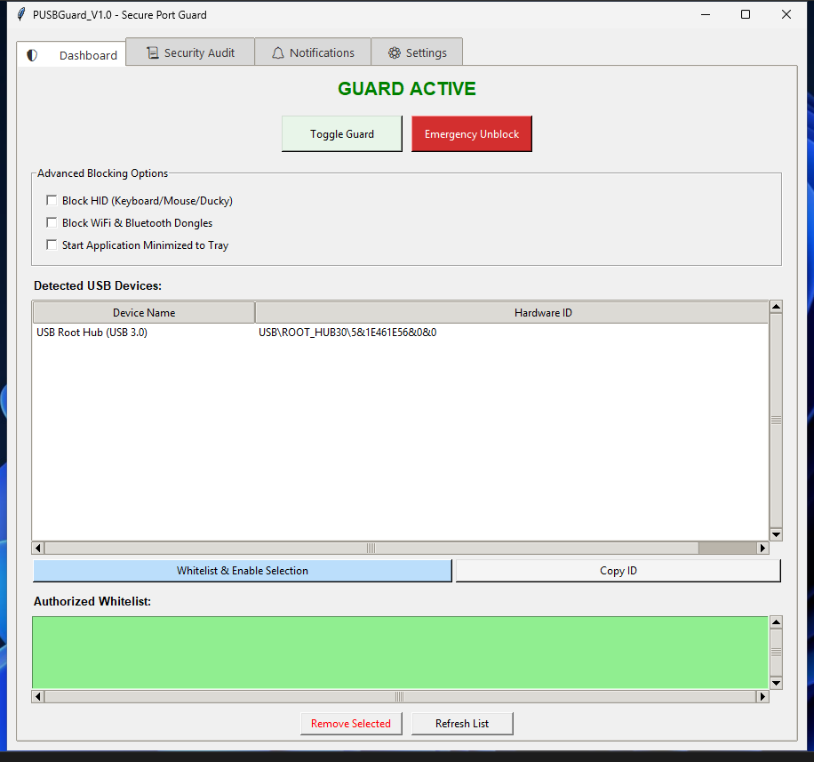
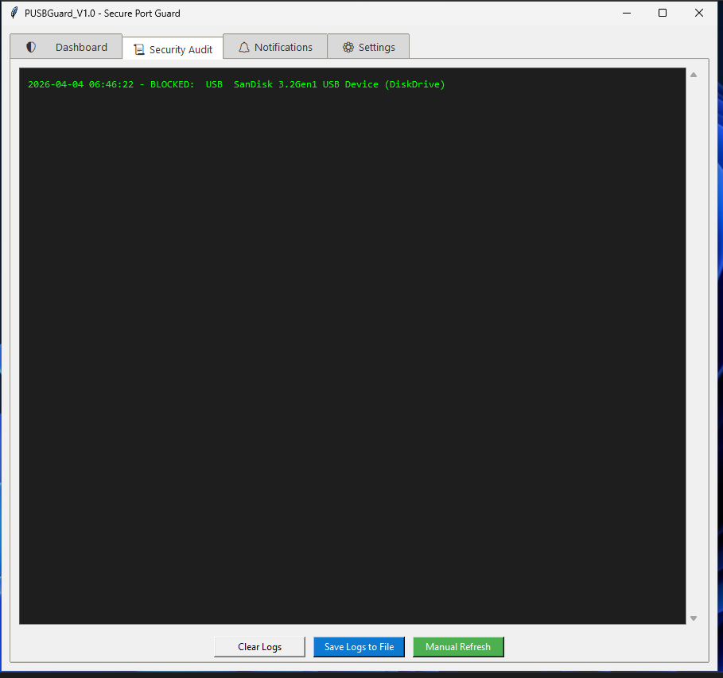
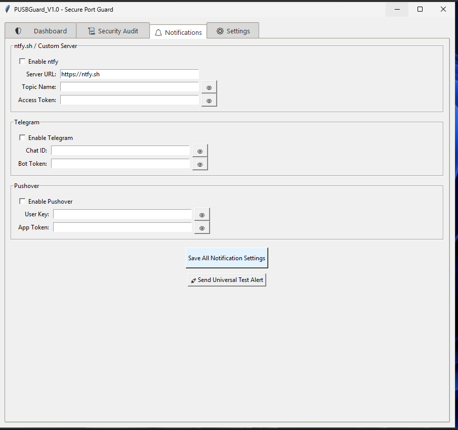
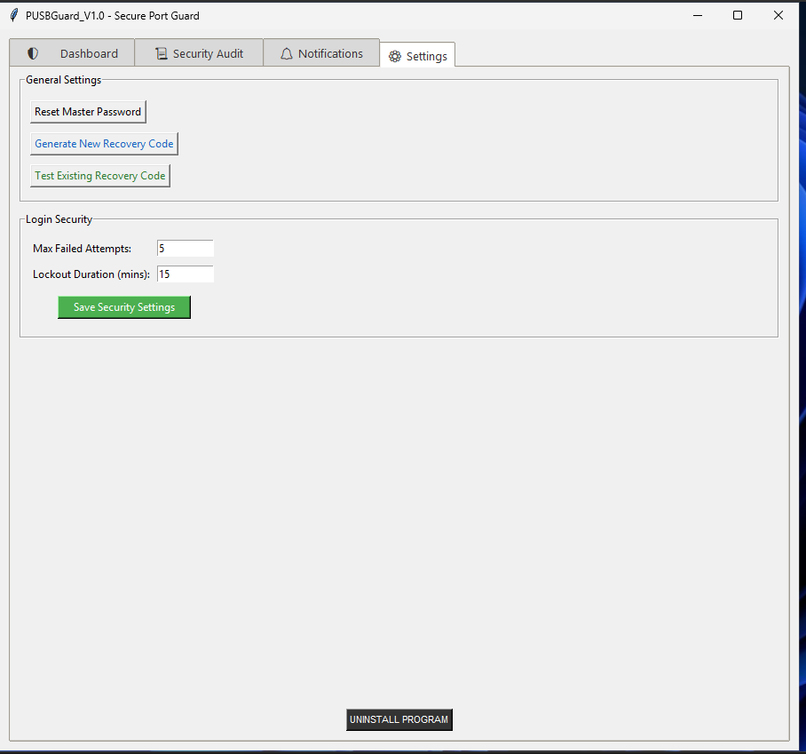

# PUSBGuard
Python USB Guard for Windows with whitelist

## Sreenshots:

  
Click to view App Screenshots

   
  
  
  
  

## 🚀 Key Advantages (Pros)

* 🛡️ BadUSB/HID Defense: Bypasses "keyboard injection" attacks (like ATtiny/Rubber Ducky) by disabling devices at the PnP driver level before payloads can execute.
* 🩺 Self-Healing Architecture: Integrated "heartbeat" monitor detects if the enforcer task is stopped or deleted and auto-repairs it within 20 seconds.
* 🔏 Hardened Credential Storage: Uses Windows Credential Manager to store salted PBKDF2 hashes for Admin passwords and Recovery Keys.
* 👻 Stealth Operation: Operates from a hidden, system-protected root folder (C:\PUSBGuard) with restricted ACL permissions.
* 📡 Multi-Channel Alerting: Real-time notifications via Telegram, ntfy.sh, and Pushover with built-in anti-spam cooling.
* ⚡ Defender Negotiation: Automatically injects Microsoft Defender exclusions for the agent process and root directory during initialization.
* 🖥️ Enterprise Ready: Fully compatible with Windows 11 Pro/LTSC and Windows Server 2022.

------------------------------
## 🛠️ How to Rebuild the App
To build the standalone .exe from the source, follow these steps:
1. Prerequisites

* Python 3.10+
* Install required libraries:

pip install -r requirements.txt

2. Prepare the Source
Ensure your src/ folder contains your main script and any required assets (icons).
3. Run PyInstaller
Use the following command to bundle the script into a single, console-less executable:

pyinstaller --noconsole --onefile --uac-admin --name=PUSBGuard_V1 pusbguard.py

* --noconsole: Hides the command prompt window on startup.
* --onefile: Bundles everything into a single .exe.
* --uac-admin: Requests UAC elevation automatically.

4. Locate Output
The final executable will be located in the dist/ folder.
------------------------------
## 🔒 Security Verification

* SHA-256 Hash: bd318cf03e393c4918d1514ac98fcbb1edf1b3a0847150a65522f29df04c373c
* VirusTotal: [View Scan Results](https://www.virustotal.com/gui/file/bd318cf03e393c4918d1514ac98fcbb1edf1b3a0847150a65522f29df04c373c)

------------------------------
## ⚖️ Disclaimer
This tool modifies system-level registry keys and scheduled tasks. Use at your own risk. The developer is not responsible for accidental system lockouts.
