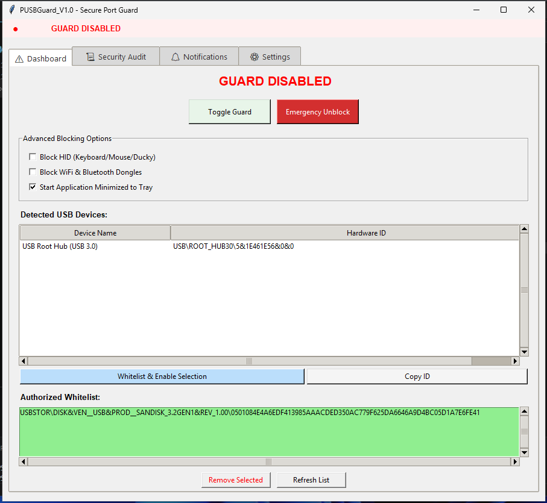
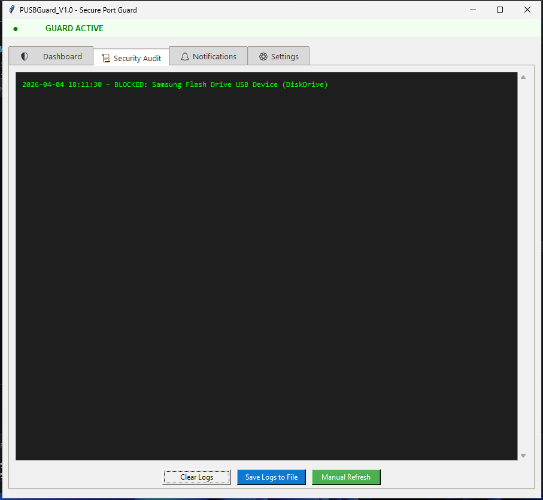
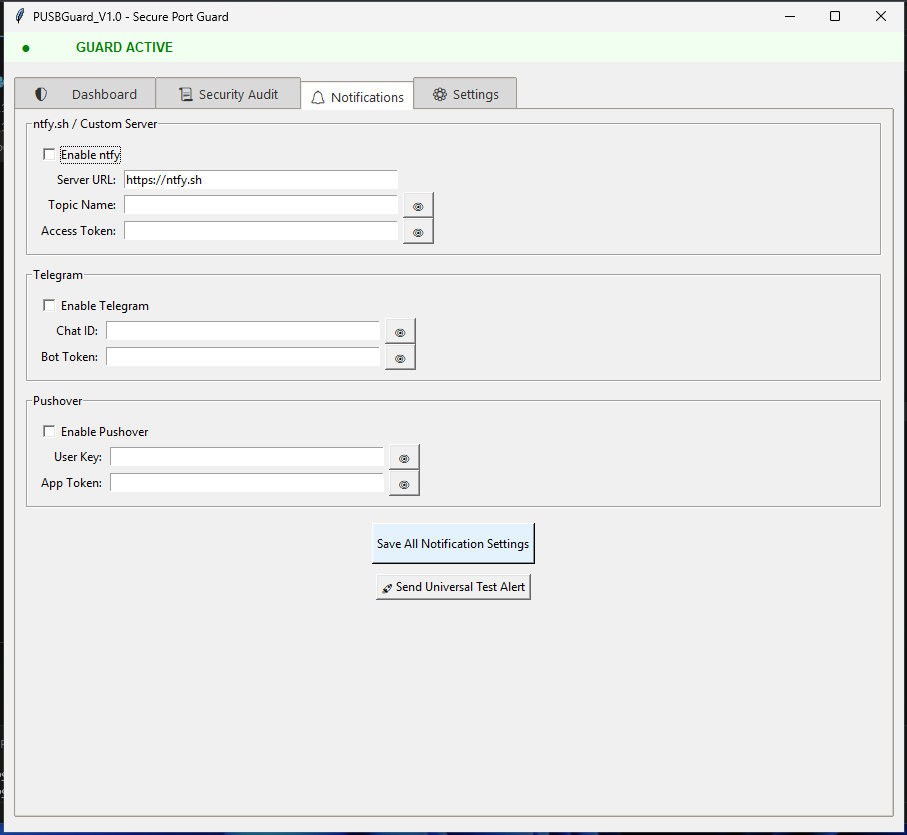
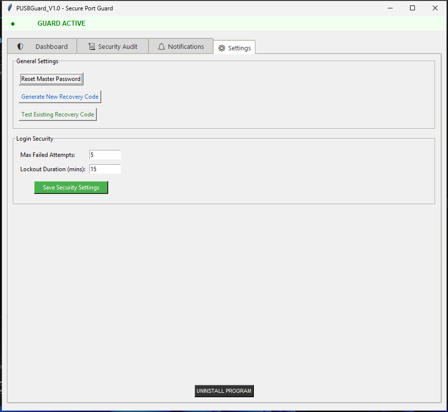
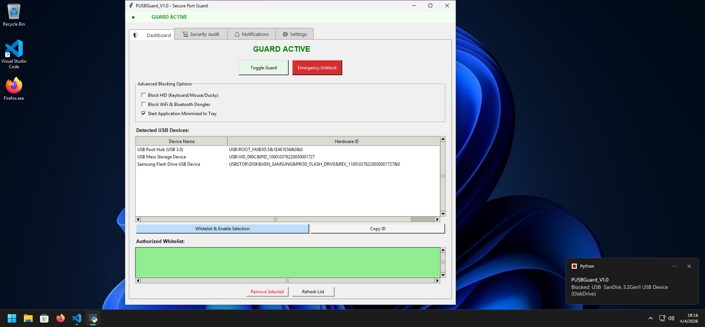

# PUSBGuard
Python USB Guard for Windows with whitelist

# 🎁  Support my work
# If you find this project helpful, you can support me  here:
[💰 Buy Me A Coffee](https://shields.io)](https://buymeacoffee.com/Delphiniki)    :credit_card: 

## Direct Link to executable:
- [Download PUSBGuard_V1.0.exe (Direct Link)](https://github.com/Delphiniki/PUSBGuard/raw/refs/heads/main/build/PUSBGuard_V1.0.exe)

## Sreenshots:

  
Click to view App Screenshots

   
  
  
  
  
  

## 🚀 Key Advantages (Pros)

* 🛡️ BadUSB/HID Defense: Bypasses "keyboard injection" attacks (like ATtiny/Rubber Ducky) by disabling devices at the PnP driver level before payloads can execute.
* 🩺 Self-Healing Architecture: Integrated "heartbeat" monitor detects if the enforcer task is stopped or deleted and auto-repairs it within 20 seconds.
* 🔏 Hardened Credential Storage: Uses Windows Credential Manager to store salted PBKDF2 hashes for Admin passwords and Recovery Keys.
* 👻 Stealth Operation: Operates from a hidden, system-protected root folder (C:\PUSBGuard) with restricted ACL permissions.
* 📡 Multi-Channel Alerting: Real-time notifications via Telegram, ntfy.sh, and Pushover with built-in anti-spam cooling.
* ⚡ Defender Negotiation: Automatically injects Microsoft Defender exclusions for the agent process and root directory during initialization.
* 🖥️ Enterprise Ready: Fully compatible with Windows 11 Pro/LTSC and Windows Server 2022.
* ℹ️ Notice: For starting application with system boot,enable option "Start Application Minimized to Tray".

------------------------------

⚠️ Running for the First Time (Windows SmartScreen) 
Because PUSBGuard_V1.0 is an unsigned open-source tool, Windows may display a "Windows protected your PC" warning. This is a standard security feature for unrecognized apps. 
To run the application safely:

    Right-click the PUSBGuard_V1.exe file and select Properties.
    In the General tab, look for the Security section at the bottom and check the Unblock box.
    Click Apply and then OK.
    Alternatively, when the blue warning box appears, click "More info" and then select "Run anyway". 

Why the warning appears:

    Unsigned Binary: As an independent project, this .exe does not have a paid digital certificate.
    PyInstaller Wrapper: The tool used to bundle the Python code into an .exe is sometimes flagged by heuristic engines as a "false positive".
    Administrative Actions: The app manages Registry keys and Scheduled Tasks, which are sensitive system behaviors. 

Verify the integrity yourself:
Always check the SHA-256 hash provided in this README against your downloaded file using PowerShell:
Get-FileHash .\PUSBGuard_V1.0.exe 

## 🛠️ How to Rebuild the App
To build the standalone .exe from the source, follow these steps:
1. Prerequisites

* Python 3.10+
* Install required libraries:

pip install -r requirements.txt

2. Prepare the Source
Ensure your src/ folder contains your main script and any required assets (icons).
3. Run PyInstaller
Use the following command to bundle the script into a single, console-less executable:

pyinstaller --noconsole --onefile --uac-admin --name=PUSBGuard_V1 pusbguard.py

* --noconsole: Hides the command prompt window on startup.
* --onefile: Bundles everything into a single .exe.
* --uac-admin: Requests UAC elevation automatically.

4. Locate Output
The final executable will be located in the dist/ folder.
------------------------------
## 🔒 Security Verification

* SHA-256 Hash: 0ae642a07a2da6c613b96af22cc3bf8bed077aeb99929bc248c88a91bfd68c80
* VirusTotal: [View Scan Results](https://www.virustotal.com/gui/file/0ae642a07a2da6c613b96af22cc3bf8bed077aeb99929bc248c88a91bfd68c80)

------------------------------
## ⚖️ Disclaimer
This tool modifies system-level registry keys and scheduled tasks. Use at your own risk. The developer is not responsible for accidental system lockouts.

# 🎁  Support my work
# If you find this project helpful, you can support me  here:
    :credit_card: 

